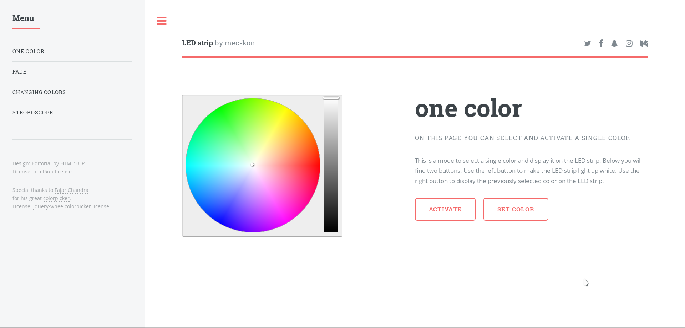

led-strip-website
====================================

This is a website that allows you to control a Led strip connected to a Raspberry Pi or ESP32 microcontroller.

Modes
--------

Three different modes are currently available.
* The one color mode allows you to select a simple color.
* The fade mode can be used to select several colors between which the color 
of the LED strip moves.
* The changing colors mode switches between all selected colors.

Download and install
--------

The easiest way to run the website is to use my self-programmed [server](https://github.com/mec-kon/led-strip-server), 
as it not only hosts the website, but also controls the Led Band.
This project is already included in my [server](https://github.com/mec-kon/led-strip-server) project as submodule.

[Check out my led-strip-server on github](https://github.com/mec-kon/led-strip-server)

Credits
--------

Special thanks to Fajar Chandra
for his great [colorpicker](https://github.com/fujaru/jquery-wheelcolorpicker) and to
[html5up](https://html5up.net/) for the html design.

Licences:
--------

* [colorpicker](https://github.com/fujaru/jquery-wheelcolorpicker/blob/master/LICENSE)
* [html5up](https://html5up.net/license)
* [gnu license]([https://github.com/mec-kon/led-strip-website/blob/experimental/GNU-LICENSE)
* [mit license](https://github.com/mec-kon/led-strip-website/blob/experimental/MIT-LICENSE)