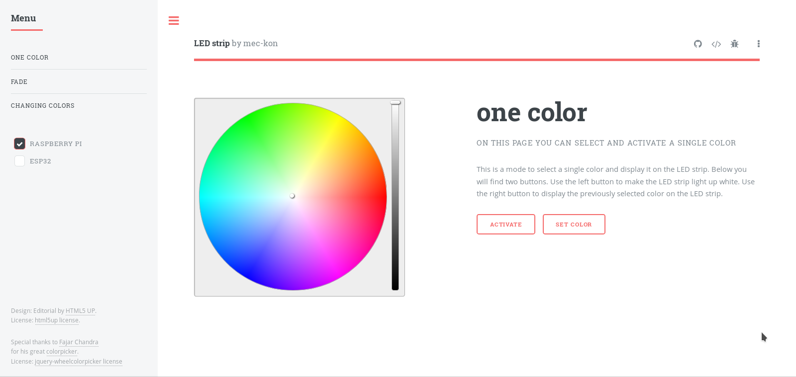

led-strip-website
====================================

This is a website that allows you to control a Led strip connected to a Raspberry Pi or ESP32 microcontroller.

Modes
--------

Three different modes are currently available.
* The one color mode allows you to select a simple color.
* The fade mode can be used to select several colors between which the color 
of the LED strip moves.
* The changing colors mode switches between all selected colors.

Demo
--------

Try out a demo [here](https://mec-kon.github.io/led-strip-website/src/)

Download and install
--------

### Raspberry Pi
The easiest way to run the website is to use my self-programmed [server](https://github.com/mec-kon/led-strip-server), 
as it not only hosts the website, but also controls the Led Band.
This project is already included in my [server](https://github.com/mec-kon/led-strip-server) project as submodule.

[Check out my led-strip-server on github](https://github.com/mec-kon/led-strip-server)

### Espressif ESP32
If you want to control your LED strip with an ESP32, you still need a Raspberry Pi to host the website.
You can do this as described above with my self-programmed server.

(The ESP32 server is currently under development)

[Check out my led-strip-server-esp32 on github](https://github.com/mec-kon/led-strip-server-esp32)

Configuration
--------
You can set the port of the web page as well as the port and ip address 
of the device to which the led strip is connected.

You can do both on the website under settings.
By default, the ip address is localhost and the port is 9999.

Protocol
--------
Currently the data is transferred from the web page to the led strip with a http post as a json file.
Later a transmission via the mqtt protocol should also be possible.

Credits
--------

Special thanks to Fajar Chandra
for his great [colorpicker](https://github.com/fujaru/jquery-wheelcolorpicker) and to
[html5up](https://html5up.net/) for the html design.

Licences:
--------

* [colorpicker](https://github.com/fujaru/jquery-wheelcolorpicker/blob/master/LICENSE)
* [html5up](https://html5up.net/license)
* [gnu license]([https://github.com/mec-kon/led-strip-website/blob/experimental/GNU-LICENSE)
* [mit license](https://github.com/mec-kon/led-strip-website/blob/experimental/MIT-LICENSE)